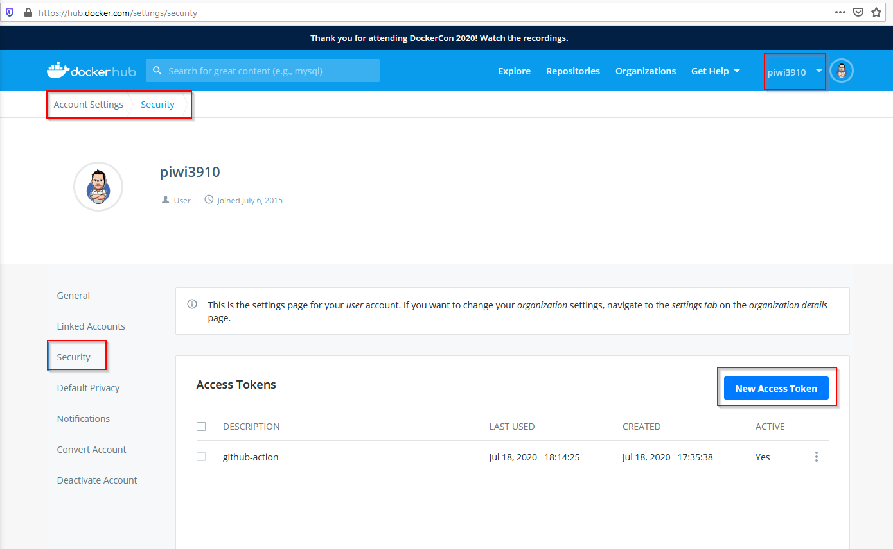
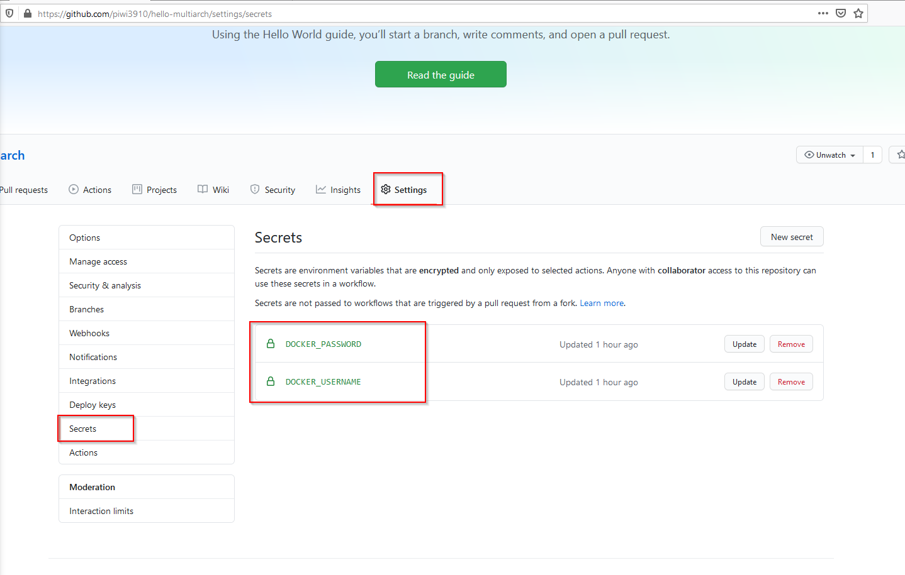

# Automated multi-arch Docker builds with DockerHub, Github and GitHub actions

## Introduction

In this episode we will see how we can combine episode 10: automated docker builds and episode 11: multi arch builds together by using GitHub Actions.

## Requirements

* Github account
* Docker Hub Account

## Setup

To be able to push from Github to our Docker Hub, we first need to setup an access token on Docker Hub. This will allow us to push to Docker Hub without sharing and keeping my password on Github.

1. Go to your Dockerhub
2. Account settings
3. Security
4. New Access token
5. Copy the password for the newly created token somewhere safe

1. Go to your GitHub project
2. settings
3. secrets
4. new secret with name DOCKER_USERNAME and value your dockerhub user
5. new secret with name DOCKER_PASSWORD and value set to the access token you created

## Code Example

[Github Multi-Arch with Github Actions](https://github.com/piwi3910/hello-multiarch)

